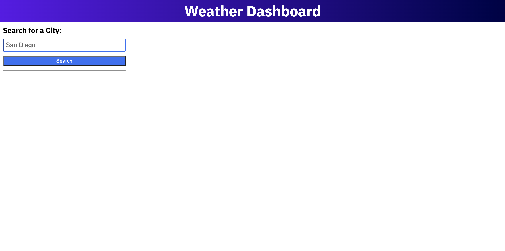

# A Weather Dashboard App

## Description
  ###### To provide weather information for the current and future five days for a city within the USA. 
  ###### Users are allowed to input a city name and to check the weather forecast accordingly. 
  ###### All cities already searched will be listed at the left side of the page, and users are allowed to click them and to check the weather information again if they want.
  ###### If the input area is blank, an alert will show up, advise the user to input a city name.
  ###### If there is no weather data for the city, or if it is a wrong city name, a message will show up on the page, advise the user there is no data.

##  Links

###### The App https://unbmattzhao.github.io/Weather_Dashboard_APP/
###### The code https://github.com/unbmattzhao/Weather_Dashboard_APP

## Screenshot

